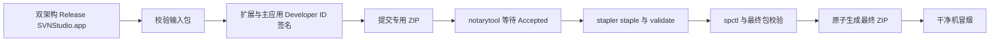

# SVN Studio 签名与公证

对外分发需 **Developer ID Application** 签名 + **notarytool** 公证 + **stapler**。本仓库脚本会验证输入 Release 包、按扩展到主应用的顺序签名、等待并核验公证结果，再发布包含 ticket 的最终 ZIP。

## 前置

| 项 | 说明 |
|----|------|
| Apple Developer 账号 | 已创建 Developer ID Application 证书 |
| 本机构建 | `./scripts/build-release-app.sh` 产出含 PlugIns 的双架构 `SVNStudio.app`（见 [README](README.md)） |
| 公证凭据 | App Store Connect API Key（`.p8`、Key ID、Issuer ID） |

## 环境变量

```bash
export SVNSTUDIO_APP_PATH="/path/to/SVNStudio.app"          # 待签名应用
export SVNSTUDIO_SIGN_IDENTITY="Developer ID Application: Your Name (TEAMID)"
export SVNSTUDIO_BUNDLE_ID="dev.yclenove.svnstudio"
export SVNSTUDIO_NOTARY_KEY_ID="…"
export SVNSTUDIO_NOTARY_ISSUER_ID="…"
export SVNSTUDIO_NOTARY_KEY_PATH="/path/to/AuthKey_….p8"
# 可选：SVNSTUDIO_DIST_DIR、SVNSTUDIO_DRY_RUN=1
```

> 兼容：仍可使用旧前缀 `MACSVN_*`，脚本会回退读取。

## 干跑

```bash
SVNSTUDIO_DRY_RUN=1 \
  SVNSTUDIO_APP_PATH=dist/release-unsigned/SVNStudio.app \
  SVNSTUDIO_SIGN_IDENTITY="Developer ID Application: Example" \
  ./scripts/sign-and-notarize.sh
```

## 流程



顺序：先签 `SVNStudioFinderSync.appex` / `SVNStudioQuickLook.appex`，再签主包。Finder Sync 重签时保留专属 App Sandbox 与文件访问 entitlements。脚本要求身份类型为 Developer ID Application，并在签名后确认主包与两个扩展均有 Developer ID Authority 且 Team ID 一致。脚本只接受 `notarytool` JSON 状态 `Accepted`；所有操作先在隐藏工作目录中完成，通过 staple、Gatekeeper 和最终包校验后才原子发布 `SVNStudio.app`，随后以临时文件原子生成 `SVNStudio.zip`。失败不会留下半签名的最终 App/ZIP。

执行前可单独检查环境：

```bash
./scripts/verify-signing-prereqs.sh
```

找不到指定签名身份、API Key 文件或公证参数时会立即失败。`SVNSTUDIO_DRY_RUN=1` 仅用于审查命令，不代表签名、公证或 Gatekeeper 已通过。

输入 App 与 `SVNSTUDIO_DIST_DIR/SVNStudio.app` 必须是不同目录；脚本会比较物理路径并拒绝相对路径、尾斜杠或 symlink 形成的别名，避免清理发布目录时删除待签名输入。

## 产物

默认输出目录为 `dist/release/`：

- `SVNStudio.app`：Developer ID 签名并已 staple 的应用
- `SVNStudio.zip`：staple 后重新生成的最终分发包
- `SVNStudio-notary-submission.zip`：公证提交留档，不用于分发
- `notary-result.json`：`notarytool` 返回结果

## 常见失败

| 现象 | 处理 |
|------|------|
| `0 valid identities found` | 将 Developer ID Application 证书及对应私钥导入当前用户钥匙串 |
| `SVNSTUDIO_NOTARY_KEY_PATH 不存在` | 配置可读的 App Store Connect API Key `.p8` 路径 |
| 输入应用与最终发布路径相同 | 将未签名 Release 放在独立目录，例如 `dist/release-unsigned/` |
| 公证状态不是 `Accepted` | 查看 `notary-result.json`，按 submission id 查询公证日志后修复再提交 |
| 签名身份类型错误 | `SVNSTUDIO_SIGN_IDENTITY` 必须是完整的 `Developer ID Application: ...` 身份名称 |
| `spctl` 拒绝 | 确认使用最终已 staple 的应用，并检查主应用与两个扩展均为同一 Team ID |
| 干净机仍提示身份不明 | 确认分发的是 staple 后重新生成的 `SVNStudio.zip`，且下载文件保留 quarantine 属性 |

## Bundle ID

- `dev.yclenove.svnstudio`
- `dev.yclenove.svnstudio.FinderSync`
- `dev.yclenove.svnstudio.QuickLook`

干净机验收见 [H1-manual-checklist.md](../acceptance/H1-manual-checklist.md)。当前 T5.7 本机实证及证书阻塞见 [distribution-smoke-2026-07-15.md](../acceptance/distribution-smoke-2026-07-15.md)。
