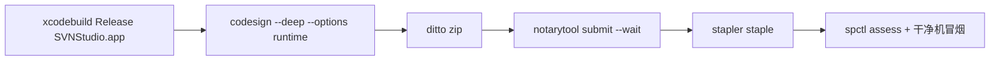

# SVN Studio 签名与公证

对外分发需 **Developer ID Application** 签名 + **notarytool** 公证 + **stapler**。本仓库提供可干跑的脚本骨架。

## 前置

| 项 | 说明 |
|----|------|
| Apple Developer 账号 | 已创建 Developer ID Application 证书 |
| 本机构建 | `xcodebuild` 产出含 PlugIns 的 `SVNStudio.app`（见 [README](README.md)） |
| 公证凭据 | App Store Connect API Key（`.p8`）或 Apple ID 方式 |

## 环境变量

```bash
export SVNSTUDIO_APP_PATH="/path/to/SVNStudio.app"          # 待签名应用
export SVNSTUDIO_SIGN_IDENTITY="Developer ID Application: Your Name (TEAMID)"
export SVNSTUDIO_BUNDLE_ID="dev.yclenove.svnstudio"
export SVNSTUDIO_NOTARY_KEY_ID="…"
export SVNSTUDIO_NOTARY_ISSUER_ID="…"
export SVNSTUDIO_NOTARY_KEY_PATH="/path/to/AuthKey_….p8"
# 可选：SVNSTUDIO_DIST_DIR、SVNSTUDIO_DRY_RUN=1
```

> 兼容：仍可使用旧前缀 `MACSVN_*`，脚本会回退读取。

## 干跑

```bash
SVNSTUDIO_DRY_RUN=1 \
  SVNSTUDIO_APP_PATH=dist/SVNStudio.app \
  SVNSTUDIO_SIGN_IDENTITY="Developer ID Application: Example" \
  ./scripts/sign-and-notarize.sh
```

## 流程



顺序：先签 `SVNStudioFinderSync.appex` / `SVNStudioQuickLook.appex`，再签主包。

## Bundle ID

- `dev.yclenove.svnstudio`
- `dev.yclenove.svnstudio.FinderSync`
- `dev.yclenove.svnstudio.QuickLook`

干净机验收见 [H1-manual-checklist.md](../acceptance/H1-manual-checklist.md)。
