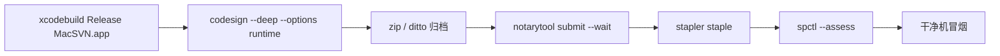

# 签名与公证（Developer ID + Notarization）

对应 SRS **NFR-10** / backlog **V4**：P4 阶段以 Developer ID 签名并公证后，可在未安装 Xcode 的干净 macOS 上经 Gatekeeper 直接打开。

> 本仓库提供**流程文档 + 脚本骨架**。真实公证需要付费 Apple Developer 账号与 App Store Connect API Key（或 app 专用密码）；CI 中勿提交密钥。

## 前置条件

| 项 | 说明 |
|----|------|
| Apple Developer Program | 已启用 |
| Developer ID Application 证书 | 安装在登录钥匙串，形如 `Developer ID Application: Your Name (TEAMID)` |
| App Store Connect API Key | 推荐：`Issuer ID` + `Key ID` + `.p8`；或 Apple ID + app 专用密码 |
| 本机构建 | `xcodebuild` 产出含 PlugIns 的 `MacSVN.app`（见 [README](README.md)） |
| 工具 | `codesign`、`xcrun notarytool`、`xcrun stapler`、`spctl`（随 Xcode CLT） |

## 推荐环境变量

```bash
export MACSVN_APP_PATH="/path/to/MacSVN.app"          # 待签名应用
export MACSVN_SIGN_IDENTITY="Developer ID Application: … (TEAMID)"
export MACSVN_BUNDLE_ID="com.yclenove.MacSVN"

# notarytool（API Key 方式，推荐）
export MACSVN_NOTARY_KEY_ID="XXXXXXXXXX"
export MACSVN_NOTARY_ISSUER_ID="xxxxxxxx-xxxx-xxxx-xxxx-xxxxxxxxxxxx"
export MACSVN_NOTARY_KEY_PATH="$HOME/private_keys/AuthKey_XXXXXXXXXX.p8"

# 可选：输出目录（默认 dist/release）
export MACSVN_DIST_DIR="$PWD/dist/release"
```

本地调试可先：

```bash
export MACSVN_DRY_RUN=1
./scripts/sign-and-notarize.sh
```

`DRY_RUN=1` 时只校验路径/身份字符串与命令拼装，不执行真实签名与上传。

## 流程概览



1. **构建**：Release + 嵌入 Finder Sync / Quick Look  
2. **签名**：对 `.app` 及内部 `.appex` 使用同一 Developer ID（脚本 `--deep`）  
3. **公证**：`notarytool submit` 等待 Accepted  
4. **装订**：`stapler staple` 将票据写入 `.app`  
5. **本机评估**：`spctl --assess --type execute`  
6. **干净机**：按 [H1 干净机冒烟](../acceptance/H1-manual-checklist.md#干净机冒烟v4) 验证 Gatekeeper

## 脚本

| 脚本 | 作用 |
|------|------|
| `scripts/verify-signing-prereqs.sh` | 检查工具与（非 DRY_RUN 时）环境变量是否齐全 |
| `scripts/sign-and-notarize.sh` | 签名 → 打包 → 公证 → staple → spctl（支持 `MACSVN_DRY_RUN=1`） |

扩展（Finder Sync / Quick Look）随主应用 `--deep` 签名；若单独签名，Bundle ID 分别为：

- `com.yclenove.MacSVN.FinderSync`
- `com.yclenove.MacSVN.QuickLook`

## 常见失败

| 现象 | 处理 |
|------|------|
| `errSecInternalComponent` | 钥匙串解锁；确认证书「始终信任」 |
| notarytool `Invalid` | 查看 `notarytool log`；检查 Hardened Runtime、entitlements |
| 干净机仍拦截 | 确认已 `stapler staple`；用装订后的 zip/dmg 分发，勿用未装订副本 |
| 扩展不生效 | 系统设置启用 Finder/QL 扩展；`qlmanage -r` |

## 与开发构建的关系

| 形态 | 签名 | 用途 |
|------|------|------|
| `swift run` / ad-hoc `codesign -` | 本地开发 | 日常开发 |
| `./scripts/build-macos-app.sh` | ad-hoc | 快速验证 `.app` 结构 |
| `sign-and-notarize.sh` | Developer ID + 公证 | 对外分发 / P4 验收 |
